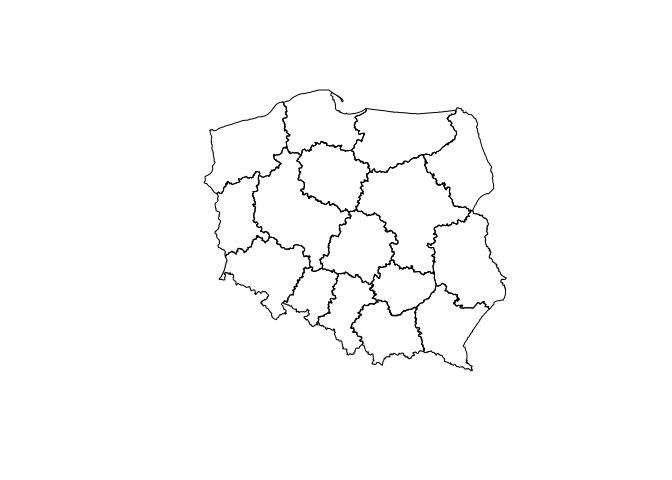

<!-- README.md is generated from README.Rmd. Please edit that file -->
prg
===

<!-- badges: start -->
<!-- badges: end -->
The goal of prg is to ...

Installation
------------

You can install the released version of prgdownloader from [CRAN](https://CRAN.R-project.org) with:

``` r
install.packages("prgdownloader")
```

And the development version from [GitHub](https://github.com/) with:

``` r
# install.packages("devtools")
devtools::install_github("skowronskij/prg")
```

Example
-------

This is a basic example which shows you how to solve a common problem:

``` r
library(prgdownloader)
poland_provinces = get_province()
#> Reading layer `OGRGeoJSON' from data source `http://3.122.248.217/tables/wojewodztwa?api-key=jEarp1RvgA4SgU3lWv3_sQ' using driver `GeoJSON'
#> Warning: st_crs<- : replacing crs does not reproject data; use st_transform for
#> that
#> Simple feature collection with 16 features and 30 fields
#> geometry type:  MULTIPOLYGON
#> dimension:      XY
#> bbox:           xmin: 171677.5 ymin: 133223.7 xmax: 861895.8 ymax: 775019.1
#> epsg (SRID):    2180
#> proj4string:    +proj=tmerc +lat_0=0 +lon_0=19 +k=0.9993 +x_0=500000 +y_0=-5300000 +ellps=GRS80 +towgs84=0,0,0,0,0,0,0 +units=m +no_defs
```

You'll still need to render `README.Rmd` regularly, to keep `README.md` up-to-date.

You can also embed plots, for example:



In that case, don't forget to commit and push the resulting figure files, so they display on GitHub!
